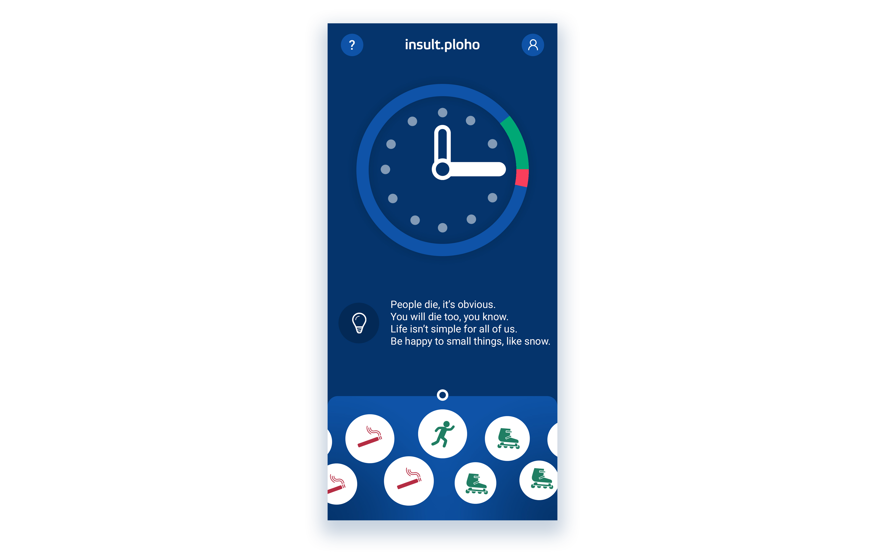
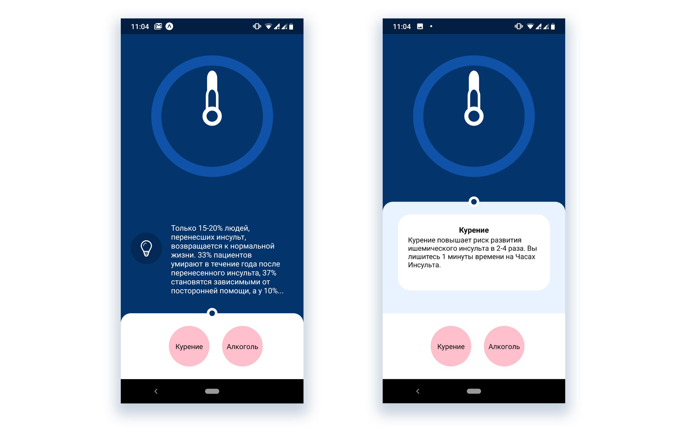

# InsultClock

## Концепт

Наша идея заключается в том, чтобы создать мобильное приложение для анализа действий пользователя, используя абстракцию часов судного дня. 

Изначально приложение попросит пользователя заполнить анкету о физической активности, вредных привычках и питании. После чего будет рассчитано, насколько человек близок к инсульту в часовых и минутных стрелках.

Дальше пользователь может двигать стрелки, выполняя действия и занося их в приложение. Например, пробежка будет отодвигать минутную стрелку назад, а выкуренная сигарета, наоборот, приближать наступление судного дня.

Также, если часы будут показывать больше 23:00 на протяжении недели, то будет предложено сделать пожертвование в фонд борьбы с инсультом.

## Решение

## Дальнейшая работа

К сожалению, за время, отведённое на Хакатон, реализовать полный функционал нам не удалось.